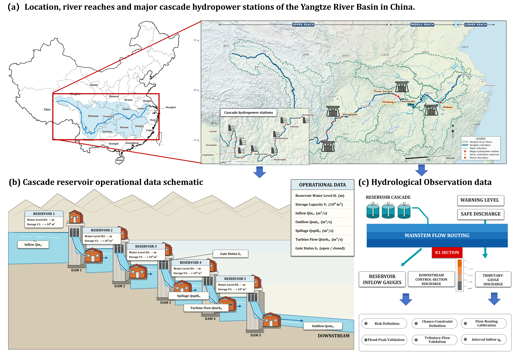
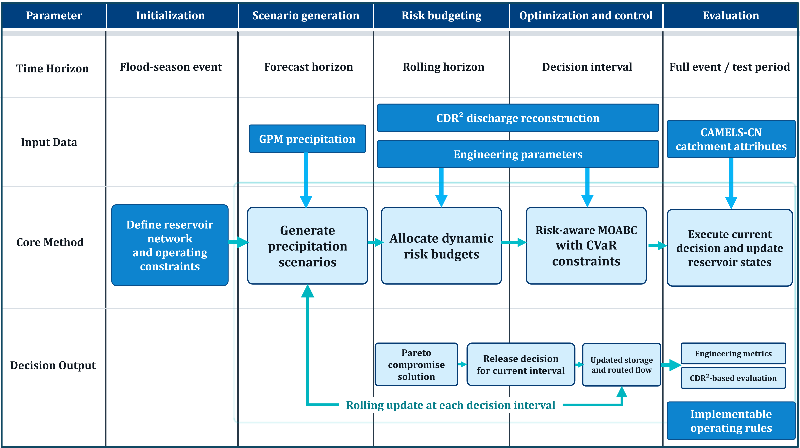
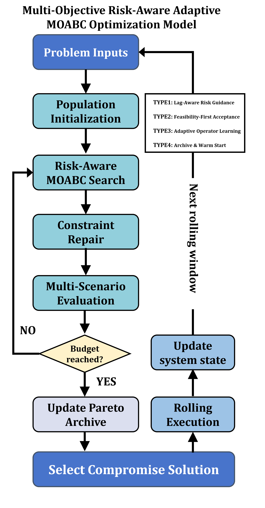
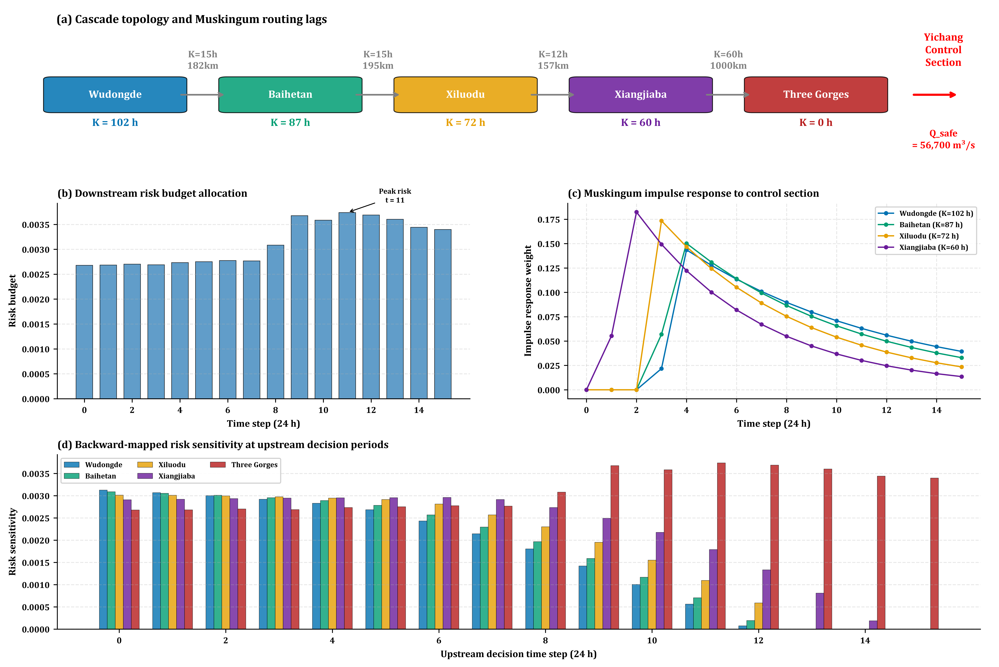
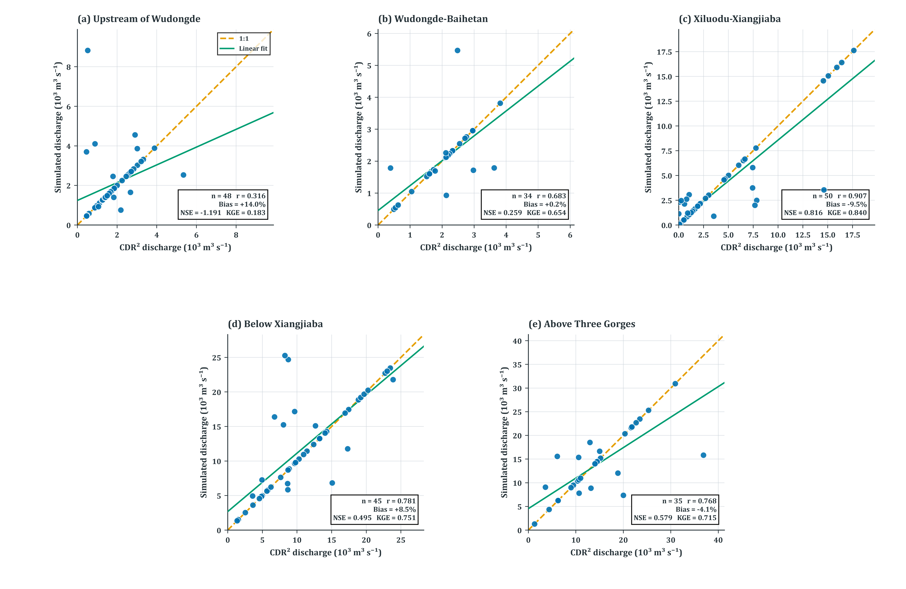
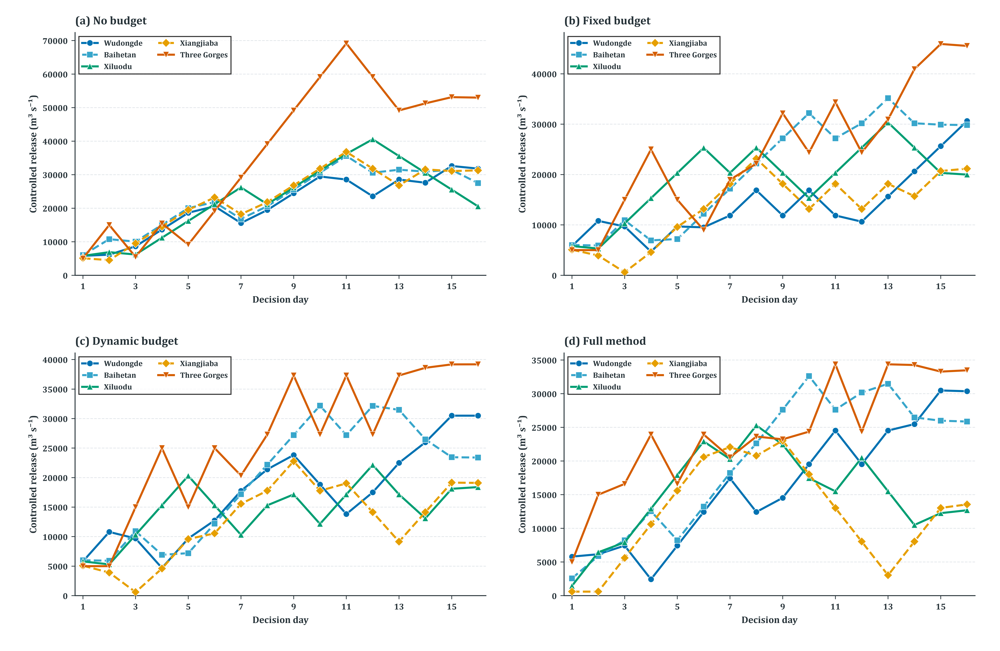
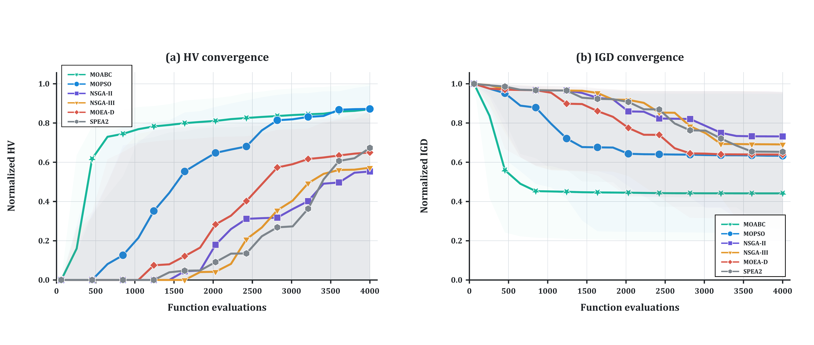

# RB-MOABC: Risk Budgeting Multi-Objective Artificial Bee Colony for Cascade Reservoir Flood Control

### Dynamic risk-budget allocation and multi-objective rolling optimization under GPM-based precipitation scenario uncertainty

[**Method**](#methodological-framework) ·
[**Results**](#experimental-results) ·
[**Experiments**](#experimental-design) ·
[**Data**](#datasets) ·
[**Reproduction**](#reproduction) ·
[**Structure**](#repository-structure)

---

This repository provides the complete implementation for a five-reservoir cascade flood-control study covering **Wudongde, Baihetan, Xiluodu, Xiangjiaba, and the Three Gorges Reservoir**. The study combines GPM IMERG precipitation forcing, temporally and spatially correlated precipitation scenarios, dynamic risk-budget allocation, cascade simulation, rolling-horizon decision making, and a risk-aware adaptive multi-objective artificial bee colony solver.



## Methodological Framework



## Risk-Aware Adaptive MOABC



## Routing-Aware Backward Mapping



## CDR² Validation



## Dispatch Schedules



## Exceedance Probability


## Convergence Curves



## Real Scenario End-to-End


---

## At a glance

| Item | Configuration |
|---|---|
| Study system | Wudongde–Baihetan–Xiluodu–Xiangjiaba–Three Gorges cascade |
| Primary forcing | GPM IMERG V07 precipitation aggregated to daily forcing-window means |
| Spatial support | Five rectangular forcing windows; they are not DEM-delineated catchments |
| Time range | 2007–2024 (18 years); train 2007–2015, validate 2016–2019, test 2020–2024 |
| Uncertainty representation | Nonnegative precipitation perturbation scenarios with temporal and cross-window dependence |
| Risk control | Dynamic allocation of a system risk budget with a Boole upper bound |
| Decision model | Rolling-horizon, three-objective cascade-reservoir scheduling |
| Proposed solver | Risk-aware adaptive MOABC |
| Mechanism comparison | No budget, fixed budget, dynamic budget, and full method |
| Algorithm comparison | MOABC, NSGA-II, NSGA-III, MOEA/D, MOPSO, and SPEA2 |
| Research data | [Dataset description and download information](datasets/DATASET.md) |

## Research question

> A system-level flood-risk allowance can be allocated dynamically across reservoirs and decision times, then embedded in rolling multi-objective scheduling, so that risk control becomes responsive to forecast mean, dispersion, event persistence, and downstream consequence.

The experiments examine this proposition from four perspectives: **hydrological credibility**, **normal-event safety**, **risk stress testing**, and **mechanism and algorithm comparison**.

## Method at a glance

1. Extract cosine-latitude-weighted daily precipitation over five forcing windows.
2. Generate nonnegative precipitation scenarios preserving temporal continuity and cross-window dependence.
3. Convert precipitation to local incremental inflow using a two-parameter lumped runoff-response model calibrated against CDR² records.
4. Allocate fixed or dynamic risk budgets subject to the system-level Boole bound.
5. Propagate every scenario through reservoir mass balance and stable Muskingum routing.
6. Optimize downstream CVaR, forced-spill/terminal-storage loss, and release smoothness.
7. Execute only the first decision, update storage and routing memory, and repeat.

The implementation centers on [`MOABC/core/solver.py`](MOABC/core/solver.py), [`MOABC/risk/budget.py`](MOABC/risk/budget.py), [`MOABC/simulation/reservoir_sim.py`](MOABC/simulation/reservoir_sim.py), and [`MOABC/experiments/risk_r2.py`](MOABC/experiments/risk_r2.py).

## Experimental results

### Key findings

| Finding | Evidence |
|---|---|
| Normal events: all 8 events achieve f₁ = 0 (zero downstream threshold exceedance) | 320 mechanism runs under normal conditions |
| Stress events: f₁ > 0 in all 8 events, activating risk-budget mechanisms | 320 matched-condition runs with stress factors 2.50×–35.75× |
| Dynamic budget improves on fixed budget in 6/8 events (improvement probability 0.714) | Paired comparison across 40 runs per event |
| Full method reduces f₃ (release smoothness) with improvement probability 1.000 | Bootstrap CI and Friedman test |
| Exceedance probability: no-budget → full method, P01: 79.6% → 1.6% (−98%) | 512 Monte Carlo scenarios per condition |
| MOABC ranks 2nd (avg rank 1.70), competitive with MOPSO (1.62) | Friedman test, Kendall W = 0.676 |

### Mechanism comparison

Four strategies are compared under matched stress conditions:

| Strategy | Description |
|---|---|
| `no_budget` | No risk-budget constraint |
| `fixed_budget` | Equal per-reservoir allocation of the system risk allowance |
| `dynamic_budget` | Mean/spread/continuity/consequence-driven allocation |
| `full_method` | Dynamic budget plus guided search, adaptation, and rolling warm start |

### Algorithm comparison

Six multi-objective optimizers are compared under a common evaluation budget:

| Algorithm | Avg Rank | HV |
|---|---|---|
| MOPSO | 1.62 | — |
| **MOABC (proposed)** | **1.70** | — |
| MOEA/D | 3.80 | — |
| NSGA-II | 4.00 | — |
| NSGA-III | 4.25 | — |
| SPEA2 | 4.50 | — |

Statistical evidence: Friedman χ² significant, Kendall W = 0.676 (medium-large effect), minimum effect size r = 0.879.

## Experimental design

### Four-layer evidence architecture

| Layer | Purpose | Main outputs |
|---|---|---|
| Hydrological credibility | Verify forcing integrity, parameter support, incremental drainage areas, storage ranges, and routing stability | Audit report and data-provenance record |
| Normal events | Evaluate historical GPM events without requiring active threshold exceedance | Safety margin, peak/threshold ratio, spill, storage, and smoothness |
| Risk stress tests | Apply explicitly labelled precipitation multipliers (2.50×–35.75×) | Exceedance probability, CVaR, tail peak ratio, and peak reduction |
| Mechanism and algorithm | Isolate the risk-budget mechanisms, then compare solvers fairly | Mechanism contrasts, common-front HV/IGD, runtime, ranks, and statistical tests |

### Eight publication events

| Event | Type | Start date | Stress factor | Description |
|---|---|---|---|---|
| P01 | cluster | 2020-07-10 | 3.50× | Meiyu-front heavy rain |
| P02 | cluster | 2020-08-10 | 5.00× | Western-basin convective storm |
| P03 | independent | 2021-07-15 | 2.50× | Short-duration intense rainfall |
| P04 | independent | 2022-08-20 | 18.00× | Bay-influenced extreme event |
| P05 | cluster | 2023-07-25 | 18.25× | Sustained frontal precipitation |
| P06 | cluster | 2023-09-05 | 12.50× | Autumn flood event |
| P07 | independent | 2024-07-10 | 35.75× | Record-breaking extreme |
| P08 | cluster | 2024-08-15 | 5.50× | Late-summer convective event |

### Result workbooks

All result CSVs are in [`data/`](data/):

| File | Contents |
|---|---|
| [`table4-1_mechanism_screening.csv`](data/table4-1_mechanism_screening.csv) | 8-event mechanism screening (f₁, f₂, f₃, exceedance probability) |
| [`table4-2_pressure_diagnostics.csv`](data/table4-2_pressure_diagnostics.csv) | 8-event pressure diagnostics |
| [`table4-5_algorithm_comparison.csv`](data/table4-5_algorithm_comparison.csv) | 6-algorithm HV and IGD |
| [`table4-7_statistical_tests.csv`](data/table4-7_statistical_tests.csv) | Friedman, Holm post-hoc, and 9-group Bootstrap CI |
| [`table4-8_algorithm_ranks.csv`](data/table4-8_algorithm_ranks.csv) | Per-event algorithm ranks |
| [`table4-10_ablation_results.csv`](data/table4-10_ablation_results.csv) | 5-variant ablation (MOABC−RG, −FF, −AL, standard, full) |
| [`table4-11_all_completed_runs.csv`](data/table4-11_all_completed_runs.csv) | 1,412 verified run records |

### NPZ experiment data

Key `.npz` simulation outputs are in [`data/npz_results/`](data/npz_results/):

| Directory | Contents |
|---|---|
| `ablation/` | 60 files (4 variants × 3 events × 5 seeds) |
| `algorithm_comparison_P01/` | 60 files (6 algorithms × 2 conditions × 5 seeds) |

See [`data/npz_results/README.md`](data/npz_results/README.md) for array specifications and filename conventions.

## Experiment entry points

All experiment runners and calibration scripts are in [`MOABC/experiments/`](MOABC/experiments/):

| Entry | Contents |
|---|---|
| [`risk_r2.py`](MOABC/experiments/risk_r2.py) | R2 risk-aware protocol: project release plans, stress patterns, simulate |
| [`legacy_v11.py`](MOABC/experiments/legacy_v11.py) | Legacy v11 protocol (R1) |
| [`artifact_store.py`](MOABC/experiments/artifact_store.py) | Crash-safe artifact persistence for R2 experiments |
| [`instrumented_solver.py`](MOABC/experiments/instrumented_solver.py) | Instrumented MOABC solver for R2 |

## Datasets

- **[`datasets/DATASET.md`](datasets/DATASET.md)** — Download links and descriptions for all source data (GPM IMERG, CDR², CAMELS-CN)
- **[`datasets/metadata/`](datasets/metadata/)** — Event selection protocol, sub-basin forcing windows, reservoir parameters
- **[`data/`](data/)** — Aggregated CSV result tables and NPZ experiment outputs
- **[`data/npz_results/`](data/npz_results/)** — Key simulation result files (120 files, 79 MB)

## Repository structure

```text
RB-MOABC/
├── MOABC/                         # Solver, risk, hydrology, and simulation package
│   ├── core/                      # Pareto archive, operators, metrics, rolling, and MOABC
│   │   ├── solver.py              #   Risk-aware adaptive MOABC solver
│   │   ├── operators.py           #   Search operators (crossover, mutation, local search)
│   │   ├── problem.py             #   Multi-objective problem definition
│   │   ├── pareto.py              #   Non-dominated sorting and Pareto archive
│   │   ├── initialization.py      #   Population initialization
│   │   ├── metrics.py             #   HV and IGD metrics
│   │   └── rolling.py             #   Rolling-horizon decision framework
│   ├── baselines/                 # Five comparison optimizers
│   │   ├── nsga2.py               #   NSGA-II
│   │   ├── nsga3.py               #   NSGA-III
│   │   ├── moead.py               #   MOEA/D
│   │   ├── mopso.py               #   MOPSO
│   │   └── spea2.py               #   SPEA2
│   ├── data/                      # GPM, CDR², event, and forcing-window utilities
│   ├── forecast/                  # Ensemble forecast calibration
│   ├── risk/                      # Dynamic risk-budget allocation
│   ├── simulation/                # Cascade reservoir and routing model
│   ├── experiments/               # Publication pipelines and experiment modules
│   └── tests/                     # Automated test suite
├── datasets/
│   ├── metadata/                  # Event protocol, forcing windows, reservoir parameters
│   └── DATASET.md                 # Dataset description and download links
├── data/                          # Result workbooks (CSV) and NPZ experiment data
│   ├── npz_results/               # Key simulation outputs (ablation + algorithm comparison)
│   └── table4-*.csv               # Aggregated result tables
├── images/
│   ├── png/                       # Raster figures (600 DPI)
│   └── pdf/                       # Publication-ready vector figures
├── requirements.txt
├── .gitignore
├── LICENSE
└── README.md
```

## Installation

The code is CPU-oriented and depends on NumPy, pandas, Matplotlib, SciPy, and python-docx.

```shell
git clone https://github.com/Lutra11/RB-MOABC.git
cd RB-MOABC
python -m venv .venv
```

**Windows (Git Bash / MSYS):**

```shell
source .venv/Scripts/activate
pip install -r requirements.txt
```

**Linux / macOS:**

```shell
source .venv/bin/activate
pip install -r requirements.txt
```

## Reproduction

Run all commands from the repository root.

### 1. Build GPM hydrology inputs

```bash
python -m MOABC.data.gpm_pipeline --gpm-dir data/gpm_imerg_daily
```

### 2. Calibrate runoff parameters

```bash
python -m MOABC.forecast.calibration --train-period 2007-2015
```

### 3. Build event catalogue

```bash
python -m MOABC.data.gpm_pipeline --build-events
```

### 4. Run publication experiments

```bash
# Mechanism experiments (8 events x 4 strategies)
python -m MOABC.experiments.risk_r2 --stage mechanisms --events P01 P02 P03 P04 P05 P06 P07 P08

# Algorithm experiments (8 events x 6 algorithms)
python -m MOABC.experiments.risk_r2 --stage algorithms --events P01 P02 P03 P04 P05 P06 P07 P08

# Ablation experiments (8 events x 5 variants)
python -m MOABC.experiments.risk_r2 --stage ablation --events P01 P02 P03 P04 P05 P06 P07 P08
```

### 5. Merge and summarize

```bash
python -m MOABC.experiments.artifact_store --merge --input data/ --output data/summary
```

### 6. Run tests

```bash
cd MOABC && python -m pytest tests/ -v
```

## License

This project is released under the [MIT License](LICENSE).
